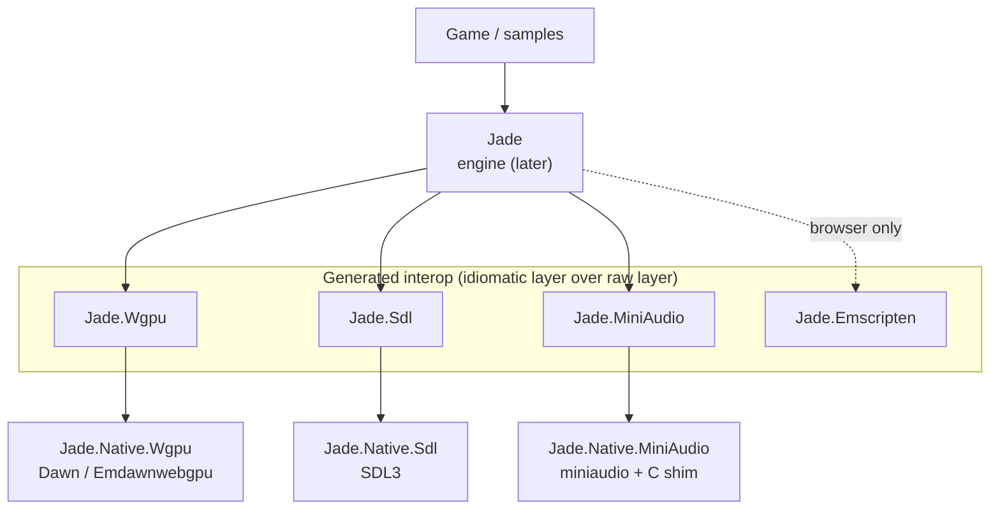
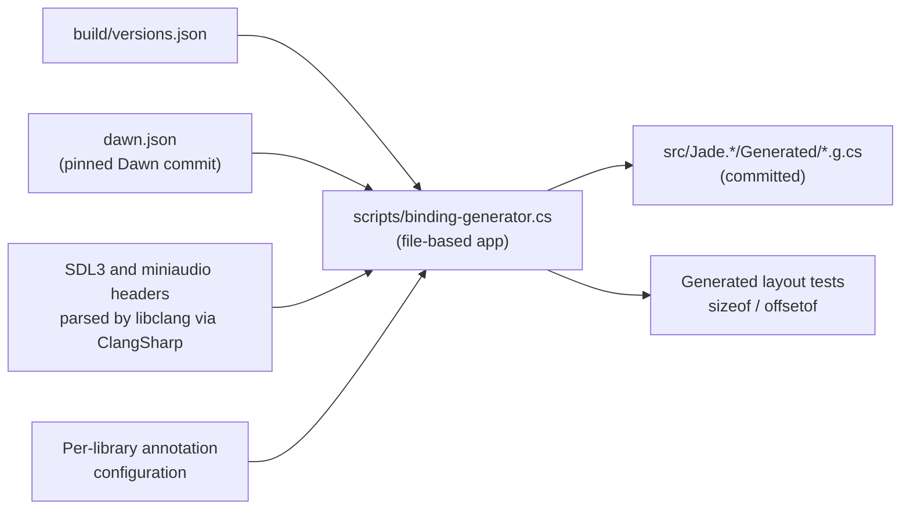
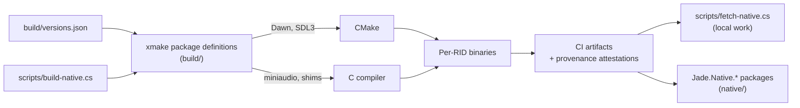

# Architecture

Jade is a 2D game engine for .NET that targets desktop (Windows, Linux, macOS), mobile (Android,
iOS) and the browser (WebAssembly). This document describes the overall structure and links to
the decision records that justify it. It describes the intended architecture: see
[Current state](#current-state) for what exists today.

The first milestone is the interop foundation: generated, idiomatic C# bindings for WebGPU (Dawn),
SDL3 and miniaudio, with the native libraries built and packaged for every target. The 2D renderer,
game loop, scene model and tools are out of scope until that foundation works on every platform.

## Layers

| Library | Role | Decision |
| --- | --- | --- |
| Dawn (WebGPU) | GPU access on every target; Emdawnwebgpu from the same commit in the browser | [0004](adr/0004-webgpu-via-dawn.md) |
| SDL3 | Windowing, input, file access, lifecycle events; its audio subsystem is never initialized | [0005](adr/0005-sdl3-platform-layer.md) |
| miniaudio | Audio; platform-dependent structs are opaque and allocated by a C shim | [0006](adr/0006-miniaudio-for-audio.md) |

Each interop project has two layers ([0008](adr/0008-two-layer-interop.md)):

- a **raw layer**, a strictly blittable image of the C API under
  `[assembly: DisableRuntimeMarshalling]`, with no runtime code generation, so it runs under JIT,
  NativeAOT, iOS AOT and Mono WebAssembly;
- an **idiomatic layer** on top: spans, `in`/`ref`/`out`, unmanaged function pointers, methods on
  the type they operate on, `Task`-based asynchronous WebGPU operations.

The mapping rules are in [0009](adr/0009-interop-mapping-conventions.md); the public API rules in
[0016](adr/0016-public-api-conventions.md).

## Projects

| Project | Target | Role |
| --- | --- | --- |
| `Jade` | .NET 11 | The engine. References the interop projects and ships the Roslyn components in `analyzers/dotnet/cs`. |
| `Jade.SourceGenerators` | `netstandard2.0`, C# 15 | Source generators for engine users; not a package. |
| `Jade.Analyzers` | `netstandard2.0`, C# 15 | Analyzers for engine users; not a package. |
| `Jade.Wgpu` | .NET 11 | WebGPU interop, generated from `dawn.json`. |
| `Jade.Sdl` | .NET 11 | SDL3 interop, generated from the C headers. |
| `Jade.MiniAudio` | .NET 11 | miniaudio interop, generated from the C headers. |
| `Jade.Emscripten` | .NET 11, no RID | Emscripten runtime interop, `[SupportedOSPlatform("browser")]` ([0019](adr/0019-browser-and-roslyn-component-targeting.md)). |
| `Jade.Native.Wgpu`, `Jade.Native.Sdl`, `Jade.Native.MiniAudio` (in `native/`) | packaging only | Native binaries for every RID ([0011](adr/0011-native-package-layout.md)). |
| `Jade.Tests` (in `tests/`) | .NET 11 | MSTest on Microsoft.Testing.Platform ([0018](adr/0018-test-framework.md)). |

Every .NET 11 library is AOT-compatible and every package that ships an assembly tracks its public
API. Build and packaging conventions are in [0021](adr/0021-build-and-packaging-conventions.md);
the repository layout in [0020](adr/0020-repository-layout-and-conventions.md).

## Binding generation

- The generator is a .NET file-based app split with `#:include`
  ([0007](adr/0007-in-house-binding-generator.md)).
- libclang is only a parser; all C# is emitted by our code.
- The output is committed. CI regenerates it and fails on any diff, which requires a deterministic
  generator.
- The generator's intermediate representation and the remaining mapping rules are open (see the
  [roadmap](roadmap.md)).

## Native build and distribution

- All natives are compiled by us, for every target ([0010](adr/0010-native-builds-with-xmake.md)).
- `build/versions.json` is the single source of pinned versions, read by the scripts, the
  generator and CI. The xmake package definitions and the C shims live in `build/`; the
  `Jade.Native.*` packaging projects live in `native/`
  ([0020](adr/0020-repository-layout-and-conventions.md)).
- Package layout ([0011](adr/0011-native-package-layout.md)):

| Target | Location in the package |
| --- | --- |
| Windows, Linux, Android | `runtimes/{rid}/native/` |
| macOS (universal) | `runtimes/osx/native/` |
| iOS | `buildTransitive/` adds a `NativeReference` to an xcframework |
| Browser | `buildTransitive/` adds `NativeFileReference` items for the static archives and passes the Emdawnwebgpu JavaScript library to `emcc` |

## Targets

Supported RIDs are listed in [0012](adr/0012-supported-targets.md). Managed code is AnyCPU; RIDs
concern only the natives and sample publication. Minimum OS versions are derived from Dawn's
requirements and pinned in `build/versions.json` (not decided yet).

### Desktop

- macOS binaries are universal (arm64 and x64 merged with `lipo`).
- Linux binaries are built against an old glibc baseline to run on as many distributions as
  possible.

### Android

- The application's `MainActivity` derives from `SDLActivity`.
- Moving to the background destroys the native surface; the WebGPU surface is recreated when the
  application returns.
- The miniaudio device is stopped and restarted on SDL3 lifecycle events.

### iOS

- Natives ship as an xcframework (device slice plus universal simulator slice) referenced from
  `buildTransitive/`.
- The miniaudio device follows SDL3 lifecycle events, as on Android.

### Browser

Details and verification in [0013](adr/0013-browser-native-toolchain.md).

- Native archives are built with exactly the Emscripten version of the SDK's `wasm-tools` workload
  (6.0.2 for SDK `11.0.100-rc.1`), with a standalone emsdk, since the workload's Emscripten cache
  is read-only and `--use-port` cannot run during `dotnet build`.
- Archives are named after the imported module (`SDL3.a`, not `libSDL3.a`).
- wasm32 has 4-byte pointers and `size_t`.
- The main loop never blocks; it is driven by `requestAnimationFrame`. WebGPU initialization is
  asynchronous, so the engine's startup path is asynchronous on every platform.

## Verification strategy

- Generated layout tests compare C `sizeof`/`offsetof` with the C# layout on every target,
  WebAssembly included.
- CI regenerates the bindings and fails if the committed code differs.
- One sample per platform family (`samples/Desktop`, `Android`, `iOS`, `Browser`) validates the
  interop and the natives end to end.
- Public API changes are tracked by the PublicApiAnalyzers files; packages pass package
  validation.
- Tests use MSTest on Microsoft.Testing.Platform. Native AOT, Android, iOS and browser test runs
  follow MSTest's documented paths ([0018](adr/0018-test-framework.md)); `Jade.Tests` checks the
  build conventions of the shipped assemblies.

## Repository and supply chain

GitHub settings, security features and their phasing are described in
[0017](adr/0017-github-repository-baseline.md).

## Current state

As of 2026-10-05 the solution is scaffolded: `global.json`, the `Directory.*` files,
`.editorconfig` and `Jade.slnx`, every project of the table above without code, the package README
and icon, and `Jade.Tests`. Build, tests and pack pass with warnings as errors and package
validation. The `Jade.Native.*` packages contain no native file yet. No script, generator, native
build (`build/` does not exist yet), sample or workflow exists. The ordered list of next tasks is
in the [roadmap](roadmap.md).
