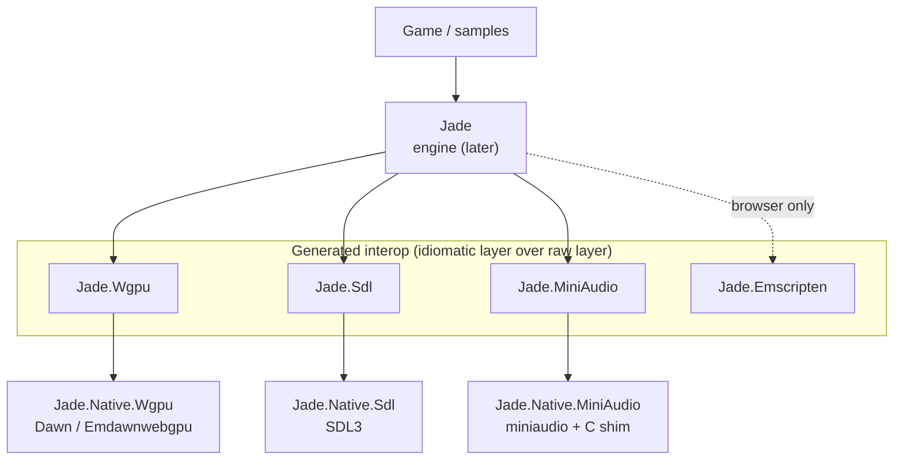
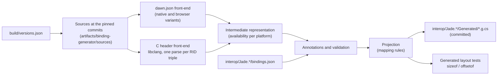
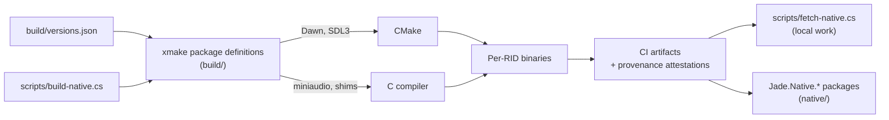

# Architecture

Jade is a 2D game engine for .NET that targets desktop (Windows, Linux, macOS), mobile (Android,
iOS) and the browser (WebAssembly). This document describes the overall structure and links to
the decision records that justify it. It describes the intended architecture: see
[Current state](#current-state) for what exists today.

The first milestone is the interop foundation: generated, idiomatic C# bindings for WebGPU (Dawn),
SDL3 and miniaudio, with the native libraries built and packaged for every target. The 2D renderer,
game loop, scene model and tools are out of scope until that foundation works on every platform.

## Layers

| Library | Role | Decision |
| --- | --- | --- |
| Dawn (WebGPU) | GPU access on every target; Emdawnwebgpu from the same commit in the browser | [0004](adr/0004-webgpu-via-dawn.md) |
| SDL3 | Windowing, input, file access, lifecycle events; its audio subsystem is never initialized | [0005](adr/0005-sdl3-platform-layer.md) |
| miniaudio | Audio; platform-dependent structs are opaque and allocated by a C shim | [0006](adr/0006-miniaudio-for-audio.md) |

Each interop project has two layers ([0008](adr/0008-two-layer-interop.md)):

- a **raw layer**, a strictly blittable image of the C API under
  `[assembly: DisableRuntimeMarshalling]`, with no runtime code generation, so it runs under JIT,
  NativeAOT, iOS AOT and Mono WebAssembly. Every declaration has a .NET name and the summary of each
  names its C declaration. The types that are identical in both layers (enums, flags, handles,
  structures without pointers) are public; the other structures and the functions are internal, in
  the `Jade.<Library>.Raw` namespace ([0034](adr/0034-raw-layer-with-dotnet-names.md));
- an **idiomatic layer** on top: spans, `in`/`ref`/`out`, unmanaged function pointers, methods on
  the type they operate on, `Task`-based asynchronous WebGPU operations. Descriptors are
  `ref struct` mirrors lowered without copy where possible and through a stack-based arena
  otherwise, and chained structures are typed generic extensions
  ([0029](adr/0029-descriptors-and-chained-structs.md)).

The mapping rules are in [0009](adr/0009-interop-mapping-conventions.md) and
[0027](adr/0027-interop-mapping-rules.md); the public API rules in
[0016](adr/0016-public-api-conventions.md).

## Projects

| Project | Target | Role |
| --- | --- | --- |
| `Jade` (in `src/`) | .NET 11 | The engine. References the interop projects and ships the Roslyn components in `analyzers/dotnet/cs`. |
| `Jade.SourceGenerators` (in `src/`) | `netstandard2.0`, C# 15 | Source generators for engine users; not a package. |
| `Jade.Analyzers` (in `src/`) | `netstandard2.0`, C# 15 | Analyzers for engine users; not a package. |
| `Jade.Wgpu` (in `interop/`) | .NET 11 | WebGPU interop, generated from `dawn.json`. |
| `Jade.Sdl` (in `interop/`) | .NET 11 | SDL3 interop, generated from the C headers. |
| `Jade.MiniAudio` (in `interop/`) | .NET 11 | miniaudio interop, generated from the C headers. |
| `Jade.Emscripten` (in `interop/`) | .NET 11, no RID | Emscripten runtime interop, `[SupportedOSPlatform("browser")]` ([0019](adr/0019-browser-and-roslyn-component-targeting.md)). |
| `Jade.Native.Wgpu`, `Jade.Native.Sdl`, `Jade.Native.MiniAudio` (in `native/`) | packaging only | Native binaries for every RID ([0011](adr/0011-native-package-layout.md)). |
| `Jade.Tests` (in `tests/`) | .NET 11 | MSTest on Microsoft.Testing.Platform ([0018](adr/0018-test-framework.md)). |
| `Jade.Wgpu.Tests`, `Jade.Sdl.Tests`, `Jade.MiniAudio.Tests` (in `tests/`) | .NET 11 | Tests of each raw layer, and export and smoke tests against the host's natives ([0032](adr/0032-webgpu-raw-layer-generation.md), [0033](adr/0033-c-header-raw-layer-generation.md)). |

Every .NET 11 library is AOT-compatible and every package that ships an assembly tracks its public
API. Build and packaging conventions are in [0021](adr/0021-build-and-packaging-conventions.md);
the repository layout in [0023](adr/0023-repository-layout-and-conventions.md).

## Binding generation

- The generator is a .NET file-based app, `scripts/binding-generator.cs`, split with `#:include`
  into `scripts/binding-generator/` ([0007](adr/0007-in-house-binding-generator.md)): one folder per
  concern (`Configuration/`, `Sources/`, `Targets/`, `Dawn/`, `Clang/`, `Model/`, `Projection/`,
  `Emission/`, `Reporting/`), one type per file, an XML comment on every type and member.
- Pipeline, intermediate representation, header parsing and configuration format:
  [0026](adr/0026-binding-generator-pipeline.md). Inputs are fetched from GitHub at the commits of
  `build/versions.json` and cached under `artifacts/`. Each declaration of the intermediate
  representation carries the platforms it exists on: `dawn.json` tags give Dawn's native header and
  Emdawnwebgpu's browser header, and C headers are parsed for the triple of every RID of
  [0012](adr/0012-supported-targets.md).
- C headers are parsed by the libclang of the pinned ClangSharp package, with `-nostdinc` and the
  generator's own C runtime headers (`scripts/binding-generator/include/`), so the result depends
  only on the pinned inputs. libclang is only a parser; all C# is emitted by our code.
- `interop/<project>/bindings.json` selects the front-end and the inputs of each generated library,
  the name its functions are imported from (`library`), the declarations it leaves out with the
  reason (`exclude`) and the exceptions to the naming rules (`names`, `words`)
  ([0032](adr/0032-webgpu-raw-layer-generation.md)). For C headers, its `clang` object adds the
  annotations of [0033](adr/0033-c-header-raw-layer-generation.md): defines, shim headers, prefixes,
  excluded headers, types mapped by name, opaque types and their shim allocators, booleans, enums
  made of macros, and constants. The `MA_*` defines live in `build/miniaudio/config.h`, which the
  native build and the generator both force-include.
- Mapping rules: [0009](adr/0009-interop-mapping-conventions.md),
  [0027](adr/0027-interop-mapping-rules.md) and [0033](adr/0033-c-header-raw-layer-generation.md).
  The raw layer has .NET names, its internal part in a `Raw` namespace
  ([0034](adr/0034-raw-layer-with-dotnet-names.md)); descriptors and chained structures follow
  [0029](adr/0029-descriptors-and-chained-structs.md).
- The output is committed. The CI `build` jobs build the generator with warnings as errors,
  regenerate the bindings on Linux, Windows and macOS, and fail on any diff, which requires a
  deterministic generator.
- The `dawn.json` front-end builds the intermediate representation of `webgpu.h` as Dawn's `api.h`
  template renders it: the chain, userdata and reference counting members it adds, the tag offsets
  of enum values, and the defaults of the `WGPU_*_INIT` macros
  ([0032](adr/0032-webgpu-raw-layer-generation.md)). The raw emitter writes one file per type:
  public enums, flags, handles, booleans and value structures in `Generated/`; internal
  structures, inline arrays and `NativeMethods` (constants and functions, imported through
  `EntryPoint`) in `Generated/Raw/` ([0034](adr/0034-raw-layer-with-dotnet-names.md)). Each
  WebGPU structure's parameterless constructor applies its `*_INIT` macro. The generated public
  declarations are listed in `PublicAPI.Unshipped.txt` through the analyzer's fix.
- The C header front-end ([0033](adr/0033-c-header-raw-layer-generation.md)) collects each
  target's parse on its own, then merges them: a declaration is available on the platform families
  whose targets declare it, and a declaration that differs between targets fails the generator
  unless it is opaque or excluded. Structures never defined or made opaque become handles; the
  layout of every other structure is checked against clang's; macros selected by the
  configuration are evaluated by clang into enums and constants; `NativeMethods` is split into one
  partial file per header. SDL3 is bound from `SDL3/SDL.h` and `SDL3/SDL_main.h` without
  `SDL_audio.h`; miniaudio from `miniaudio.h` and the shim `build/miniaudio/jade_miniaudio.h`,
  which allocates every opaque type.
- Native libraries are imported with `LibraryImport` and searched in the assembly's directory and
  the safe Windows directories (`DefaultDllImportSearchPaths`).

## Native build and distribution

- All natives are compiled by us, for every target ([0010](adr/0010-native-builds-with-xmake.md)).
- `build/xmake.lua` is the xmake project: Dawn (`build/dawn/`) and SDL3 (`build/sdl/`) are xmake
  packages built through their CMake builds, miniaudio and its shim (`build/miniaudio/`) an xmake
  target ([0031](adr/0031-native-build-definitions.md)).
- `scripts/build-native.cs` builds the host's runtime identifier (`linux-x64` only, until roadmap
  task 10). It checks that xmake and CMake are at their pinned versions, fetches each dependency
  with git at its pinned commit into `artifacts/native/sources/`, with the entries of Dawn's `DEPS`
  that `build/dawn/deps.json` lists, runs xmake with its state under `artifacts/native/`, and loads
  the libraries of `artifacts/native/bin/<rid>/` to check their exports.
- Dawn is its monolithic shared library `webgpu_dawn` with Dawn's default backends for the
  platform; on Windows it also ships the `dxcompiler.dll` it builds, and FXC comes from the system
  ([0030](adr/0030-d3d12-shader-compilers.md)). SDL3 is built without its audio subsystem, and the
  build fails when a feature of its per-platform list is missing, so that every machine produces
  the same library. miniaudio exports only its API and the shim's functions.
- The libraries keep their upstream names (`libwebgpu_dawn.so`, `libSDL3.so`, `libminiaudio.so`
  on Linux). The host build depends on the host's glibc and C++ runtime and serves local work; the
  shipped Linux binaries come from the glibc 2.28 environment of roadmap task 10.
- `build/versions.json` is the single source of pinned versions, read by the scripts, the
  generator and CI. The xmake package definitions and the C shims live in `build/`; the
  `Jade.Native.*` packaging projects live in `native/`
  ([0023](adr/0023-repository-layout-and-conventions.md)).
- `THIRD-PARTY-NOTICES.md` reproduces the licenses of every third-party component compiled into
  the natives, from the license files of the pinned sources
  ([0002](adr/0002-license-and-public-identity.md)); it changes with `build/versions.json` and with
  the build options, and is checked against the files Ninja records for each library target.
- Package layout ([0011](adr/0011-native-package-layout.md)):

| Target | Location in the package |
| --- | --- |
| Windows, Linux, Android | `runtimes/{rid}/native/` |
| macOS (universal) | `runtimes/osx/native/` |
| iOS | `buildTransitive/` adds a `NativeReference` to an xcframework |
| Browser | `buildTransitive/` adds `NativeFileReference` items for the static archives and passes the Emdawnwebgpu JavaScript library to `emcc` |

### `build/versions.json`

A JSON object with three groups. JSON has no comments, so every entry carries a `source` that says
where its value was verified (release, tag, manifest or ADR); `Jade.Tests` fails when an entry has
no `source` or a dependency has no full commit hash.

| Group | Entries | Fields |
| --- | --- | --- |
| `dependencies` | `dawn`, `sdl`, `miniaudio` | `repository`, `tag`, `version` (when upstream has one), `commit` (40 hexadecimal characters), `license` (SPDX expression), `source` |
| `toolchains` | `emscripten`, `androidNdk`, `xmake`, `cmake` | `version` and tool-specific fields: `provider` and `packVersion` for Emscripten, which comes from the SDK's `wasm-tools` workload ([0025](adr/0025-browser-natives-with-workload-emscripten.md)); `revision` for the NDK; `source` |
| `minimumOs` | one object | `windows`, `linuxGlibc`, `macos`, `ios`, `androidApiLevel`, `source` ([0024](adr/0024-minimum-os-versions.md)) |

Dawn is pinned to one of its GitHub releases (`vYYYYMMDD.HHMMSS` tags on the `google/dawn`
mirror), which also publish the Emdawnwebgpu package of the same commit. The third-party sources
that Dawn builds (Abseil, SPIRV-Tools, Vulkan headers and others) are pinned by Dawn's own `DEPS`
file at that commit.

## Targets

Supported RIDs are listed in [0012](adr/0012-supported-targets.md). Managed code is AnyCPU; RIDs
concern only the natives and sample publication. Minimum OS versions are the highest hard floors
of Dawn, SDL3, miniaudio and .NET 11 ([0024](adr/0024-minimum-os-versions.md)), pinned in
`build/versions.json` and used as the compile targets of the natives:

| Family | Minimum |
| --- | --- |
| Windows | Windows 10 version 1607 (build 14393) |
| Linux | glibc 2.28 |
| macOS | 14.0 |
| iOS | 14.0 |
| Android | API 26 (Android 8.0) |
| Browser | a browser that exposes WebGPU |

A core WebGPU adapter also needs a Vulkan 1.1, D3D12 or Metal 2.3 driver; Dawn rates its iOS
support "best effort" and its Android support "work in progress".

### Desktop

- macOS binaries are universal (arm64 and x64 merged with `lipo`).
- Linux binaries are built against glibc 2.28 to run on as many distributions as possible.

### Android

- The application's `MainActivity` derives from `SDLActivity`.
- Moving to the background destroys the native surface; the WebGPU surface is recreated when the
  application returns.
- The miniaudio device is stopped and restarted on SDL3 lifecycle events.

### iOS

- Natives ship as an xcframework (device slice plus universal simulator slice) referenced from
  `buildTransitive/`.
- The miniaudio device follows SDL3 lifecycle events, as on Android.

### Browser

Details and verification in [0025](adr/0025-browser-natives-with-workload-emscripten.md).

- Native archives are built with the Emscripten toolchain of the SDK's own `wasm-tools` workload,
  called outside `dotnet build`, because no upstream emsdk equals it: for SDK `11.0.100-rc.1` the
  packs are named 6.0.2, their `emcc` reports 6.0.3, and they are built from .NET's forks of
  Emscripten and LLVM. Archives are rebuilt whenever the SDK changes. `--use-port` cannot run
  during `dotnet build`, since the workload's Emscripten cache is read-only.
- Archives are named after the imported module (`SDL3.a`, not `libSDL3.a`).
- wasm32 has 4-byte pointers and `size_t`.
- The main loop never blocks; it is driven by `requestAnimationFrame`. WebGPU initialization is
  asynchronous, so the engine's startup path is asynchronous on every platform.

## Verification strategy

- Every pull request is built, tested and packed on Linux, Windows and macOS with warnings as
  errors, its formatting is checked, and CodeQL analyzes it (see
  [Repository and supply chain](#repository-and-supply-chain)).
- Generated layout tests compare C `sizeof`/`offsetof` with the C# layout on every target,
  WebAssembly included.
- CI regenerates the bindings on every host and fails if the committed code differs.
- Each interop assembly's test project checks its raw layer, checks that the host's library
  exports every function imported for its platform, and runs smoke tests against the host's
  natives from `artifacts/native/bin/<rid>/`; they are skipped where the natives are not built.
- One sample per platform family (`samples/Desktop`, `Android`, `iOS`, `Browser`) validates the
  interop and the natives end to end.
- Public API changes are tracked by the PublicApiAnalyzers files; packages pass package
  validation.
- Tests use MSTest on Microsoft.Testing.Platform. Native AOT, Android, iOS and browser test runs
  follow MSTest's documented paths ([0018](adr/0018-test-framework.md)); `Jade.Tests` checks the
  build conventions of the shipped assemblies.

## Repository and supply chain

GitHub settings, security features and their phasing are described in
[0017](adr/0017-github-repository-baseline.md); runners and caching in
[0022](adr/0022-ci-runners-and-caching.md).

| Workflow | Trigger | Role |
| --- | --- | --- |
| `ci.yml` | pull requests, pushes to `main` | `format` (`dotnet format --verify-no-changes`), then restore, build with warnings as errors, test, pack with package validation, build the binding generator with warnings as errors and check the regenerated bindings on `build (linux)`, `build (windows)` and `build (macos)` |
| `codeql.yml` | pull requests, pushes to `main`, weekly | CodeQL for C# (traced build with the pinned SDK) and GitHub Actions |
| `scorecard.yml` | pushes to `main`, weekly | OpenSSF Scorecard, published for the README badge and uploaded to code scanning |
| `labels.yml` | changes to `.github/labels.yml` | Synchronizes the repository labels with `gh`; dry run on pull requests |
| `labeler.yml` | pull requests (`pull_request_target`) | Applies the area labels of `.github/labeler.yml` from the changed paths |

- The `main` ruleset requires `format`, the three `build` checks and the two CodeQL `analyze`
  checks, on a branch up to date with `main`.
- Every workflow sets `permissions: {}` at the top and grants each job only what it needs; every
  action is pinned to a full commit SHA with its version in a comment, and Dependabot updates them
  weekly, with the NuGet packages, after a seven-day cooldown.
- Jobs run on pinned GitHub-hosted images (`ubuntu-24.04`, `windows-2025`, `macos-26`, and
  `ubuntu-slim` for API-only jobs) and use no cache.

## Current state

As of 2026-10-05 the solution is scaffolded: `global.json`, the `Directory.*` files,
`.editorconfig` and `Jade.slnx`, every project of the table above without code, the package README
and icon, and `Jade.Tests`. Build, tests and pack pass with warnings as errors and package
validation. The `Jade.Native.*` packages contain no native file yet. The CI baseline is in place:
the workflows above, Dependabot, issue and pull request templates, `CODEOWNERS`,
`CONTRIBUTING.md` and `CODE_OF_CONDUCT.md`. The native dependencies, toolchains and minimum OS
versions are pinned in `build/versions.json`, and `THIRD-PARTY-NOTICES.md` covers the pinned
sources. The binding generator fetches and loads the pinned inputs (`dawn.json`, and the SDL3 and
miniaudio headers parsed for every RID) and generates the raw layers of `Jade.Wgpu` (296 files,
276 functions), `Jade.Sdl` (350 files, 1,177 functions) and `Jade.MiniAudio` (292 files, 955
functions). On the host, `Jade.Wgpu.Tests` creates a WebGPU instance and requests an adapter,
`Jade.Sdl.Tests` initializes SDL3 video and creates a window, and `Jade.MiniAudio.Tests`
initializes a miniaudio context. The idiomatic layers and `Jade.Emscripten`, which will be generated
too ([0035](adr/0035-emscripten-interop-generation.md)), are still to come.
`scripts/build-native.cs` builds Dawn, SDL3 and miniaudio for `linux-x64` from the definitions of
`build/`; the other RIDs, CI artifacts and packaging come later. No sample exists yet. The ordered
list of next tasks is in the [roadmap](roadmap.md).
